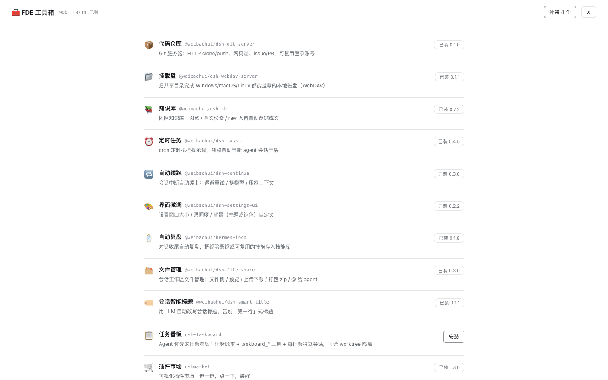

# @weibaohui/dsh-fde-tools

[](https://github.com/topics/dsh-plugin)
[](https://www.npmjs.com/package/@weibaohui/dsh-fde-tools)

**FDE 工具箱全家桶**：安装一个插件，带上一批插件（当前 14 件）。

装进 profile 后，设置里出现「FDE 工具箱」，列出全家桶成员的安装状态：
缺什么点「安装」（或「补装」一键带齐）；「检查更新」对照 npm latest，
有新版逐个或一键「更新」。宿主侧用 pnpm 装包并把成员追加进
`dsh.profile.bundles`，装完/更新完提示重启 dsh 生效。必装成员（登录门禁）缺失时面板会醒目提示。



## 全家桶成员

| 成员 | 说明 |
| --- | --- |
| 🔐 [user-management](https://www.npmjs.com/package/@weibaohui/user-management)（必装） | 登录门禁：未登录弹登录/注册页，用户/角色/审计、TOTP 两步验证 |
| 📦 [dsh-git-server](https://www.npmjs.com/package/@weibaohui/dsh-git-server) | Git 服务器（内嵌 ts-gogs）：HTTP clone/push、网页端、issue/PR |
| 📁 [dsh-webdav-server](https://www.npmjs.com/package/@weibaohui/dsh-webdav-server) | 共享目录变挂载盘：WebDAV，三平台可挂，令牌认证 |
| 📚 [dsh-kb](https://www.npmjs.com/package/@weibaohui/dsh-kb) | 团队知识库：浏览 / 全文检索 / raw 入料自动蒸馏成文 |
| ⏰ [dsh-tasks](https://www.npmjs.com/package/@weibaohui/dsh-tasks) | 定时任务：cron 到点自动开新 agent 会话干活 |
| 🔁 [dsh-continue](https://www.npmjs.com/package/@weibaohui/dsh-continue) | 自动续跑：会话中断自动退避重试 / 换模型 / 压缩上下文 |
| 🎨 [dsh-settings-ui](https://www.npmjs.com/package/@weibaohui/dsh-settings-ui) | 界面微调：设置窗口大小 / 透明度 / 背景 |
| 🪞 [hermes-loop](https://www.npmjs.com/package/@weibaohui/hermes-loop) | 自动复盘：对话收尾蒸馏经验成可复用技能 |
| 🗂️ [dsh-file-share](https://www.npmjs.com/package/@weibaohui/dsh-file-share) | 会话工作区文件管理：文件树 / 预览 / 上传下载 / 打包 zip / @ 给 agent |
| 🏷️ [dsh-smart-title](https://www.npmjs.com/package/@weibaohui/dsh-smart-title) | 会话智能标题：用 LLM 自动改写，告别「第一行」式标题 |
| 📋 [dsh-taskboard](https://www.npmjs.com/package/dsh-taskboard) | Agent 优先的任务看板：任务账本 + agent 工具 + 每任务独立会话 |
| 🛒 [dshmarket](https://www.npmjs.com/package/dshmarket) | 可视化插件市场：逛一逛，点一下，装好 |
| 🧠 [dsh-context](https://www.npmjs.com/package/dsh-context) | 上下文仪表盘 + `/context` 命令，看清上下文组成与演化 |
| 💬 [@xmanrui/dsh-im](https://www.npmjs.com/package/@xmanrui/dsh-im) | 十一种 IM 渠道和公网 AI Office 接入本机 Harness |
| 🧭 [dsh-better-sidebar](https://www.npmjs.com/package/dsh-better-sidebar) | VSCode 式右侧边栏（资源管理器/编辑器/终端/git/浏览器），按会话隔离 |

成员清单在 `src/installer.js` 的 `PACK`，加一行即扩包（`range` 取 npm latest 加 `^`），面板与接口自动跟上。

## 安装

```sh
dsh plugin --profile web add @weibaohui/dsh-fde-tools
```

1. 重启 dsh，设置里出现「FDE 工具箱」
2. 「补装 N 个」（或逐个点「安装」）
3. 再重启一次，全家桶生效

装完显示重启提示；机器上有 dsh web 的 launchd 守护时，自动按守护配置生成对应的 `launchctl kickstart` 命令供复制，其余环境只提示重启。

## 工作原理

- dsh 的插件 = profile `package.json` 的依赖 + `dsh.profile.bundles` 里的加载层；
  纯 npm 依赖聚合带不动子插件（reconcile 只认 profile 直接依赖），
  所以引导器在宿主侧替你执行 `pnpm add <member>@<range>` 并追加 bundles。
- **快照还原**：pnpm 在 profile 里跑 add 有清掉 `link:`/`file:` 依赖的前科，
  安装前把依赖和 bundles 快照到 `<profile>/.fde-tools-install-snapshot.json`，
  装完 diff，丢了就按快照补回再 `pnpm install`（≤2 轮），仍失败则报错并给出快照路径。
- **构建脚本自动放行**：依赖带安装期构建脚本（如 dsh-git-server 的 better-sqlite3、
  dsh-better-sidebar 的 node-pty）时，pnpm 会拦下并退出非零；引导器识别
  `ERR_PNPM_IGNORED_BUILDS`，把包以 `包名@版本: true` 写进 `pnpm-workspace.yaml`
  的 `allowBuilds` 后自动重试一次。
- 已在 profile 依赖里的成员（无论 npm / link / github spec）一律跳过，不会覆盖现有安装方式。

### 环境变量

| 变量 | 作用 |
| --- | --- |
| `DSH_FDE_TOOLS_PROFILE` | 手动指名所属 profile（名或绝对路径）；缺省自动扫描 `~/.dsh/profiles` |
| `DSH_FDE_TOOLS_PNPM` | 手动指名 pnpm 可执行文件；缺省按 PATH → `~/.local/bin/pnpm` → 宿主同前缀的 pnpm.cjs 顺序探测 |
| `DSH_HOME` | dsh 主目录（缺省 `~/.dsh`） |

## License

MIT
